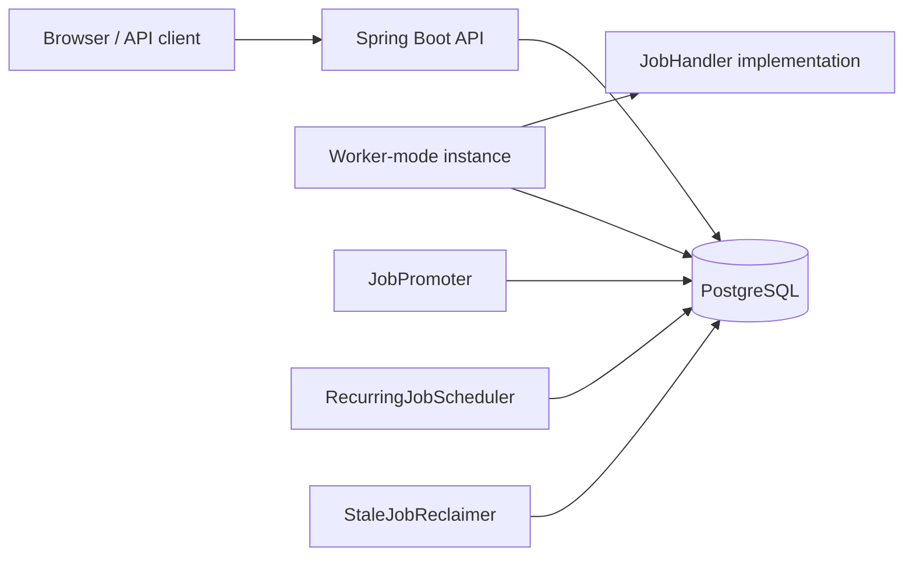
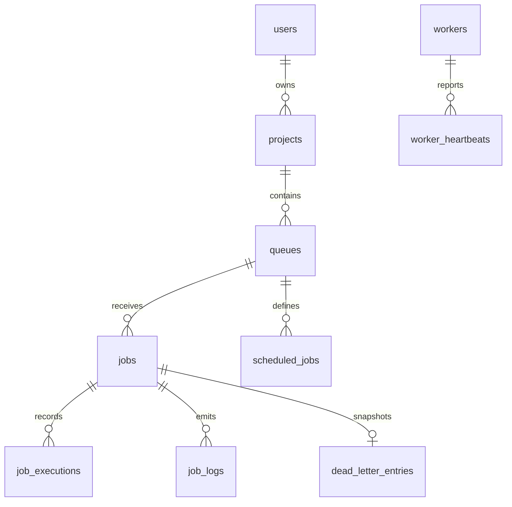
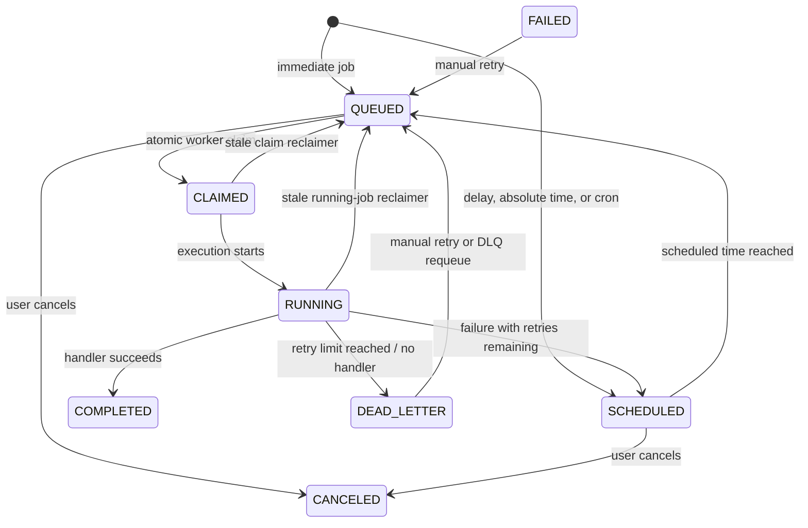

# Scheduler — Project Documentation

## 1. Purpose

Scheduler is a multi-tenant background-job system built with Spring Boot and PostgreSQL. A user owns projects; projects contain queues; queues hold immediate, delayed, batch, and recurring jobs. Worker-mode application instances atomically claim jobs, execute a handler, record the attempt and logs, retry failures, and finally move exhausted jobs into a dead-letter queue (DLQ).

## 2. Technology stack

| Area | Technology |
|---|---|
| Runtime | Java 25 |
| Framework | Spring Boot 4, Spring MVC, Spring Data JPA, Spring Security |
| Database | PostgreSQL 16 |
| Persistence | Hibernate (schema update mode by default) |
| Authentication | JWT (`jjwt`) with BCrypt password hashing |
| Build and tests | Maven Wrapper, JUnit 5, Mockito |
| Deployment | Docker / Docker Compose |

## 3. Architecture



### Core data relationships



The `worker_heartbeats.worker_id` column is an application-level identifier. It is not mapped as a database foreign key in the current entity model.

## 4. Job lifecycle



| Status | Meaning |
|---|---|
| `QUEUED` | Available for a worker to claim. |
| `SCHEDULED` | Waiting until `scheduled_at`. |
| `CLAIMED` | Atomically reserved by a worker, but not yet started. |
| `RUNNING` | Handler invocation is in progress. |
| `COMPLETED` | Handler completed successfully. |
| `FAILED` | Recorded as an attempt status; it may be manually retried. |
| `DEAD_LETTER` | Permanent failure; a DLQ snapshot is created. |
| `CANCELED` | Cancelled before execution. |

## 5. Scheduler components

| Component | Frequency | Responsibility |
|---|---:|---|
| `JobPromoter` | 1 second | Changes due `SCHEDULED` jobs to `QUEUED`. |
| `JobPoller` | 500 ms | In worker mode, atomically claims up to 10 queued jobs and submits them. |
| `JobPoller` heartbeat | 5 seconds | Updates the worker’s current state and stores heartbeat history. |
| `JobExecutor` | on demand | Runs jobs on a fixed pool of 10 threads. |
| `RecurringJobScheduler` | 60 seconds | Materializes jobs for enabled recurring definitions whose next run is due. |
| `StaleJobReclaimer` | 15 seconds | Requeues jobs running for more than 10 minutes or claimed for more than 30 seconds without starting; stops workers stale for more than 30 seconds. |

### Claiming and concurrency

The claim query uses PostgreSQL `FOR UPDATE SKIP LOCKED`, ordered by descending priority and then earliest `scheduled_at`. This lets multiple worker instances poll concurrently without claiming the same row or waiting for an already locked candidate.

`queues.concurrency_limit` is persisted and returned by the API but is not currently enforced by the claiming query.

### Retry rules

Job-level retry settings are copied from queue defaults when the job is created, unless supplied in the request. Retry scheduling uses `RetryPolicy`:

| Strategy | Delay for attempt `n` | Notes |
|---|---|---|
| `FIXED` | constant base delay | Default base: 10 seconds |
| `LINEAR` | `base × n` | Default base: 10 seconds |
| `EXPONENTIAL` | `base × 2^(n-1)` | Default base: 5 seconds |

Delays are capped at one hour. A job becomes `DEAD_LETTER` when its incremented `retry_count` is no longer below `max_retries`.

## 6. Database schema

Hibernate creates or updates the schema from the entities (`spring.jpa.hibernate.ddl-auto=update`). The table definitions below document the application model; exact generated PostgreSQL DDL may include provider-specific identity and constraint syntax.

### `users`

| Column | Type | Null | Key / default | Description |
|---|---|---:|---|---|
| `id` | bigint | no | PK, identity | User identifier. |
| `name` | varchar | no | | Display name. |
| `email` | varchar | no | unique (`uk_users_email`) | Login email. |
| `password_hash` | varchar | no | | BCrypt password hash. |
| `created_at` | timestamp | no | application default now | Creation time. |
| `updated_at` | timestamp | no | application default now | Updated automatically on entity update. |

### `projects`

| Column | Type | Null | Key / default | Description |
|---|---|---:|---|---|
| `id` | bigint | no | PK, identity | Project identifier. |
| `name` | varchar | no | | Project name. |
| `owner_id` | bigint | no | FK → `users.id`; index `idx_projects_owner` | Owning user. |
| `created_at` | timestamp | no | application default now | Creation time. |
| `updated_at` | timestamp | no | application default now | Last update time. |

### `queues`

| Column | Type | Null | Key / default | Description |
|---|---|---:|---|---|
| `id` | bigint | no | PK, identity | Queue identifier. |
| `name` | varchar | no | | Queue name. |
| `project_id` | bigint | no | FK → `projects.id` | Parent project. |
| `priority` | integer | no | `0` | Default priority for created jobs. |
| `concurrency_limit` | integer | no | `5` | Stored queue concurrency setting; not enforced yet. |
| `paused` | boolean | no | `false` | Blocks new jobs and recurring job spawning. |
| `default_max_retries` | integer | no | `3` | Default job retry limit. |
| `default_retry_strategy` | varchar(20) | yes | `EXPONENTIAL` | Queue retry strategy enum. |
| `created_at` | timestamp | no | application default now | Creation time. |
| `updated_at` | timestamp | no | application default now | Last update time. |

### `jobs`

| Column | Type | Null | Key / default | Description |
|---|---|---:|---|---|
| `id` | bigint | no | PK, identity | Job identifier. |
| `queue_id` | bigint | no | FK → `queues.id`; index `idx_jobs_queue` | Owning queue. |
| `type` | varchar | no | | Handler bean name to execute. |
| `payload` | varchar/text | yes | | Handler input. |
| `status` | varchar(20) | no | index `idx_jobs_status` | `JobStatus` enum. |
| `priority` | integer | no | `0` | Higher values are claimed first. |
| `scheduled_at` | timestamp | yes | | Promotion time for scheduled jobs. |
| `cron_expression` | varchar | yes | | Source cron expression, if supplied. |
| `batch_id` | varchar | yes | | Shared generated identifier for a batch request. |
| `retry_count` | integer | no | `0` | Number of failed attempts. |
| `max_retries` | integer | no | `3` | Retry limit. |
| `retry_strategy` | varchar(20) | yes | `EXPONENTIAL` | `RetryMethods` enum. |
| `worker_id` | varchar | yes | | Worker currently/previously assigned. |
| `claimed_at` | timestamp | yes | | Claim timestamp. |
| `started_at` | timestamp | yes | | Execution start timestamp. |
| `completed_at` | timestamp | yes | | Completion timestamp. |
| `last_error` | text | yes | | Latest failure reason. |
| `created_at` | timestamp | no | application default now | Creation time. |
| `updated_at` | timestamp | no | application default now | Last update time. |

Indexes: `idx_jobs_claim(status, queue_id, priority, scheduled_at)`, `idx_jobs_queue(queue_id)`, and `idx_jobs_status(status)`.

### `scheduled_jobs` (recurring job definitions)

| Column | Type | Null | Key / default | Description |
|---|---|---:|---|---|
| `id` | bigint | no | PK, identity | Definition identifier. |
| `queue_id` | bigint | no | FK → `queues.id` | Owning queue. |
| `name` | varchar | no | | User-facing definition name. |
| `type` | varchar | no | | Handler type copied to spawned jobs. |
| `payload` | text | yes | | Payload copied to spawned jobs. |
| `cron_expression` | varchar | no | | Six-field Spring cron expression. |
| `priority` | integer | no | `0` | Priority copied to spawned jobs. |
| `max_retries` | integer | no | `3` | Retry limit copied to spawned jobs. |
| `retry_strategy` | varchar(20) | yes | `EXPONENTIAL` | Retry strategy copied to spawned jobs. |
| `enabled` | boolean | no | `true` | Whether it may spawn jobs. |
| `next_run_at` | timestamp | no | | Next computed occurrence. |
| `last_run_at` | timestamp | yes | | Most recent spawn time. |
| `created_at` | timestamp | no | application default now | Creation time. |
| `updated_at` | timestamp | no | application default now | Last update time. |

Index: `idx_recurring_next_run(enabled, next_run_at)`.

### `job_executions`

| Column | Type | Null | Key / default | Description |
|---|---|---:|---|---|
| `id` | bigint | no | PK, identity | Attempt identifier. |
| `job_id` | bigint | no | FK → `jobs.id`; index `idx_executions_job` | Executed job. |
| `attempt_number` | integer | no | | One-based attempt number. |
| `worker_id` | varchar | no | index `idx_executions_worker` | Worker that ran it. |
| `status` | varchar(20) | no | | Attempt status (`RUNNING`, `COMPLETED`, or `FAILED`). |
| `started_at` | timestamp | no | | Start time. |
| `completed_at` | timestamp | yes | | Finish time. |
| `error_message` | text | yes | | Error returned from a failing handler. |

### `job_logs`

| Column | Type | Null | Key / default | Description |
|---|---|---:|---|---|
| `id` | bigint | no | PK, identity | Log identifier. |
| `job_id` | bigint | no | FK → `jobs.id`; index `idx_job_logs_job(job_id, created_at)` | Related job. |
| `level` | varchar(10) | no | | `INFO`, `WARN`, or `ERROR`. |
| `message` | text | no | | Structured event message. |
| `created_at` | timestamp | no | application default now | Log timestamp. |

### `dead_letter_entries`

| Column | Type | Null | Key / default | Description |
|---|---|---:|---|---|
| `id` | bigint | no | PK, identity | DLQ entry identifier. |
| `job_id` | bigint | no | unique FK → `jobs.id`; index `idx_dlq_job` | Failed job; one entry per job. |
| `reason` | text | no | | Permanent-failure explanation. |
| `payload_snapshot` | text | yes | | Payload captured at failure. |
| `retry_count_at_failure` | integer | no | | Retry count when dead-lettered. |
| `failed_at` | timestamp | no | application default now | Failure timestamp. |

### `workers`

| Column | Type | Null | Key / default | Description |
|---|---|---:|---|---|
| `worker_id` | varchar(64) | no | PK | Random UUID generated by `JobPoller`. |
| `hostname` | varchar | yes | | Hostname registered at startup. |
| `status` | varchar(20) | no | `ACTIVE` | `WorkerStatus` enum. |
| `active_job_count` | integer | no | `0` | Current in-process job count. |
| `started_at` | timestamp | no | application default now | First registration time. |
| `last_heartbeat_at` | timestamp | yes | application default now | Most recent heartbeat. |

### `worker_heartbeats`

| Column | Type | Null | Key / default | Description |
|---|---|---:|---|---|
| `id` | bigint | no | PK, identity | Heartbeat identifier. |
| `worker_id` | varchar(64) | no | index `idx_heartbeats_worker(worker_id, heartbeat_at)` | Reporting worker ID. |
| `heartbeat_at` | timestamp | no | application default now | Report time. |
| `active_job_count` | integer | no | `0` | Active work at the report time. |

## 7. HTTP API

### Authentication

Register or log in, then send `Authorization: Bearer <token>` on authenticated calls. The JWT subject is the email and its `userId` claim becomes the Spring Security principal.

> Current implementation note: `SecurityConfig` permits every request. Controller methods that use `Authentication` still require a valid bearer token in practice, because they read the authenticated principal. Restricting non-auth routes is recommended before production use.

### Endpoints

| Method | Path | Purpose |
|---|---|---|
| `POST` | `/api/auth/register` | Create a user and return a JWT. |
| `POST` | `/api/auth/login` | Authenticate and return a JWT. |
| `GET` | `/api/projects` | List projects belonging to the caller. |
| `POST` | `/api/projects` | Create a project. |
| `GET` | `/api/projects/{projectId}/queues` | List project queues. |
| `POST` | `/api/projects/{projectId}/queues` | Create a queue. |
| `GET` | `/api/queues/{queueId}` | Get queue configuration and job counts. |
| `PATCH` | `/api/queues/{queueId}` | Update queue configuration. |
| `POST` | `/api/queues/{queueId}/pause` | Pause a queue. |
| `POST` | `/api/queues/{queueId}/resume` | Resume a queue. |
| `GET` | `/api/queues/{queueId}/stats` | Get queue configuration and job counts. |
| `POST` | `/api/queues/{queueId}/jobs` | Enqueue one job. |
| `POST` | `/api/queues/{queueId}/jobs/batch` | Enqueue a batch. |
| `GET` | `/api/queues/{queueId}/jobs` | List jobs; optional `status`, pageable query parameters. |
| `GET` | `/api/queues/{queueId}/jobs/{jobId}` | Get a job. |
| `DELETE` | `/api/queues/{queueId}/jobs/{jobId}` | Cancel a `QUEUED` or `SCHEDULED` job. |
| `POST` | `/api/queues/{queueId}/jobs/{jobId}/retry` | Requeue a `FAILED` or `DEAD_LETTER` job. |
| `GET` | `/api/queues/{queueId}/jobs/{jobId}/logs` | Get job logs. |
| `GET` | `/api/queues/{queueId}/jobs/{jobId}/executions` | Get attempt history. |
| `GET` | `/api/queues/{queueId}/recurring-jobs` | List recurring definitions. |
| `POST` | `/api/queues/{queueId}/recurring-jobs` | Create a recurring definition. |
| `DELETE` | `/api/queues/{queueId}/recurring-jobs/{name}` | Delete a recurring definition by name. |
| `POST` | `/api/queues/{queueId}/recurring-jobs/{id}/pause` | Disable a recurring definition. |
| `POST` | `/api/queues/{queueId}/recurring-jobs/{id}/resume` | Enable a recurring definition. |
| `GET` | `/api/dlq` | List dead-letter entries (pageable). |
| `POST` | `/api/dlq/{id}/requeue` | Requeue a DLQ job. |
| `GET` | `/api/workers` | List known workers. |

### Request examples

```bash
# Register
curl -X POST http://localhost:8080/api/auth/register \
  -H 'Content-Type: application/json' \
  -d '{"name":"Ada","email":"ada@example.com","password":"password123"}'

# Create a project
curl -X POST http://localhost:8080/api/projects \
  -H "Authorization: Bearer $TOKEN" -H 'Content-Type: application/json' \
  -d '{"name":"Operations"}'

# Create a queue
curl -X POST http://localhost:8080/api/projects/1/queues \
  -H "Authorization: Bearer $TOKEN" -H 'Content-Type: application/json' \
  -d '{"name":"emails","priority":5,"concurrencyLimit":5,"defaultMaxRetries":3,"defaultRetryStrategy":"EXPONENTIAL"}'

# Enqueue immediately. Note the implemented JSON property is payLoad (capital L).
curl -X POST http://localhost:8080/api/queues/1/jobs \
  -H "Authorization: Bearer $TOKEN" -H 'Content-Type: application/json' \
  -d '{"type":"programExecute","payLoad":"{\"path\":\"/usr/bin/true\"}","priority":10}'

# Schedule after 60 seconds (delaySecond), at an ISO-8601 time (atTime), or by cron (cronExp).
curl -X POST http://localhost:8080/api/queues/1/jobs \
  -H "Authorization: Bearer $TOKEN" -H 'Content-Type: application/json' \
  -d '{"type":"programExecute","payLoad":"{}","delaySecond":60}'

# Define an enabled recurring job; cron uses Spring's six-field syntax.
curl -X POST http://localhost:8080/api/queues/1/recurring-jobs \
  -H "Authorization: Bearer $TOKEN" -H 'Content-Type: application/json' \
  -d '{"name":"daily-report","type":"programExecute","payload":"{\"path\":\"/usr/bin/true\"}","cronExpression":"0 0 6 * * *"}'
```

### Request body fields

| Endpoint family | Required fields | Optional fields |
|---|---|---|
| Registration | `name`, `email`, `password` (min. 8 chars) | — |
| Login | `email`, `password` | — |
| Project | `name` | — |
| Queue | `name` | `priority`, `concurrencyLimit`, `defaultMaxRetries`, `defaultRetryStrategy` |
| Single job | `type` | `payLoad`, `priority`, `delaySecond`, `atTime`, `cronExp`, `maxRetries`, `retryStrategy` |
| Batch job | `jobs` (non-empty list of single-job bodies) | — |
| Recurring job | `name`, `type`, `cronExpression` | `payload`, `priority`, `maxRetries`, `retryStrategy` |

If more than one of `atTime`, `delaySecond`, and `cronExp` is supplied for a single job, the implementation applies them in this order: `atTime`, then `delaySecond`, then `cronExp`.

### Error format

The global exception handler responds with:

```json
{
  "timestamp": "2026-08-12T06:08:23Z",
  "status": 409,
  "error": "Conflict",
  "message": "Cannot enqueue job: queue is paused"
}
```

`IllegalArgumentException` maps to `404`, `IllegalStateException` to `409`, ownership failures to `403`, and bean-validation failures to `400`.

## 8. Job handlers

Handlers implement `JobHandler` and are looked up by Spring bean name using `job.type`.

```java
@Component("sendEmail")
public class SendEmailHandler implements JobHandler {
    @Override
    public void handle(String payload) {
        // parse payload and send email
    }
}
```

Use `"type":"sendEmail"` when enqueueing a job. A missing handler permanently dead-letters the job. Handlers should be idempotent because a process failure after a side effect but before persistence can cause a job to be reclaimed and run again.

The existing `ProgramExecute` handler accepts JSON with a `path` field and starts that program. Treat it as a trusted/internal facility: accepting arbitrary paths from untrusted users can execute arbitrary programs.

## 9. Configuration and running

### Local prerequisites

- JDK 25
- Docker Desktop (for PostgreSQL or full Compose deployment)

```bash
./mvnw test
./mvnw spring-boot:run
```

The default application configuration connects to `jdbc:postgresql://localhost:5432/jobs` as `postgres` / `password`, runs in `worker` mode, uses Hibernate `update`, and sets Hibernate’s JDBC time zone to `Asia/Kolkata`.

### Docker Compose

```bash
docker compose up
```

Compose starts PostgreSQL, one API container on port `8080`, and one worker container. The current checked-in `application.properties` uses literal local datasource values; for containers, ensure the commented environment-placeholder properties are enabled or provide equivalent active configuration so `SPRING_DATASOURCE_*`, `APP_MODE`, and `SPRING_JPA_HIBERNATE_DDL_AUTO` are consumed.

### Configuration reference

| Property | Current value | Meaning |
|---|---|---|
| `spring.datasource.url` | `jdbc:postgresql://localhost:5432/jobs` | JDBC endpoint. |
| `spring.datasource.username` | `postgres` | Database user. |
| `spring.datasource.password` | `password` | Database password; replace outside local development. |
| `app.mode` | `worker` | Enables `JobPoller` only when set to `worker`. |
| `spring.jpa.hibernate.ddl-auto` | `update` | Hibernate schema behavior. |
| `spring.jpa.database-platform` | PostgreSQL dialect | SQL dialect. |
| `spring.jpa.properties.hibernate.jdbc.time_zone` | `Asia/Kolkata` | Hibernate JDBC time zone. |

## 10. Tests

Run the complete suite with:

```bash
./mvnw test
```

The suite covers cron validation, retry-backoff rules, JWT handling, user and queue services, polling, recurring job creation, promotion/reclamation, and executor success/failure/DLQ paths. Tests use mocks for repositories, so PostgreSQL is not required for the unit-test run.

## 11. Known limitations and production considerations

- Enforce authentication in `SecurityConfig`; it currently permits all routes.
- Do not commit production database credentials or JWT signing secrets; externalize them as secrets/environment variables.
- Add a database migration tool such as Flyway or Liquibase before production; `ddl-auto=update` is convenient for development but is not a migration strategy.
- Enforce `concurrency_limit` in the claim query if per-queue parallelism limits are required.
- The recurring-definition delete lookup is by name only, not by queue ID; duplicate names across queues can produce unintended deletion.
- The DLQ list currently does not filter by owner in its repository query; authorization should be enforced at query level as well as requeue level.
- Use `app.mode=api` for an API-only instance and `app.mode=worker` for worker instances. The promoter, recurring scheduler, and reclaimer are not conditional in the current source, so API instances also run those tasks.
